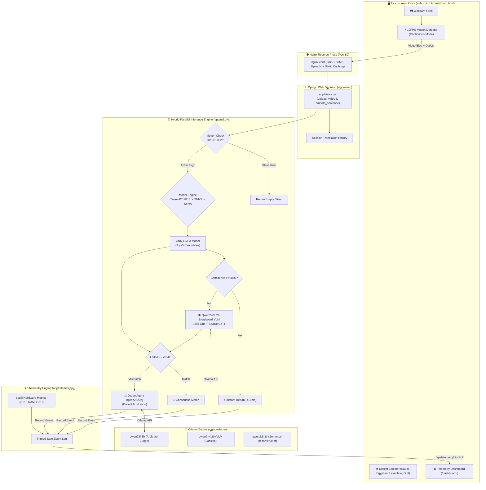

# 🤟 Signo — Arabic Sign Language Kiosk & AI Translation System

[](https://www.python.org/)
[](https://www.djangoproject.com/)
[](https://www.tensorflow.org/)
[](https://developer.nvidia.com/tensorrt)
[](https://ollama.com/)
[](https://www.docker.com/)

---

## 📌 Project Overview

**Signo** is an enterprise-grade, real-time **Arabic Sign Language (ArSL) Translation System and Touchscreen Kiosk** built for **NVIDIA Jetson Orin Nano** edge hardware. It bridges the communication gap for deaf and hard-of-hearing individuals by converting continuous sign gestures into fluent spoken Arabic and English sentences in real-time.

---

## 🏗️ System Architecture



---

## 🔥 Key Engineering Advancements

### 1. Hybrid Parallel Consensus & Judge Architecture
* **Dual-Model Inference:** Runs the fast **CNN-LSTM coordinate tracker** in parallel with **Qwen2-VL:2b (VLM)**.
* **Storyboard Keyframe Extraction:** `app/vlm_util.py` extracts a 2x3 sequential temporal grid from video feeds for direct visual evaluation.
* **LLM Judge Arbitrator:** When models disagree, `qwen2.5:3b` acts as an AI Arbitrator (`app/llm_util.py`), resolving disputes using regional dialect syntax and session history.

### 2. Zero-Hallucination & Accuracy Precision Engine
* **Deterministic Greedy Decoding (`temperature=0.0`):** Applied across all VLM and LLM inference calls to eliminate token hallucination.
* **Strict Candidate Whitelisting:** Both the VLM and Judge LLM outputs are programmatically constrained to strictly match valid items from the Top-5 candidate list.
* **Hand Motion Rest-Gating Filter:** Standard deviation analysis (`std < 0.002`) on hand keypoints suppresses false-positive word predictions when the user is at rest.
* **High-Confidence Fast-Path ($\ge 88\%$):** If CNN-LSTM confidence is $\ge 88\%$, the result returns in **< 10ms**, bypassing the VLM.

### 3. NVIDIA Jetson Orin Nano TensorRT FP16 Engine
* **Automated ONNX & TensorRT Converter (`export_tensorrt.py`):** Converts `conv1_lstm.keras` ➔ `conv1_lstm.onnx` ➔ `conv1_lstm.engine`.
* **Sub-6ms Latency:** Utilizes NVIDIA Tensor Cores for high-speed edge execution.
* **Multi-Backend Runtime Fallback:** `app/util.py` automatically detects and selects: **TensorRT FP16 Engine** ➔ **ONNX Runtime GPU** ➔ **Keras TensorFlow**.

### 4. Continuous Hands-Free Mode & Dialect Routing
* **Browser-Side Motion Segmentation:** 10FPS pixel-difference loop in `index.html` detects when signing pauses and auto-submits video clips.
* **Regional Dialect Selector:** Supports **Saudi KARSL**, **Egyptian**, **Levantine**, and **Gulf** sign dialects.

### 5. Touchscreen Kiosk UX & Text-To-Speech (TTS)
* **Touch-Optimized Controls:** Finger-friendly 54px+ touch target buttons, tap highlight suppression, and tactile press scaling (`scale(0.95)`).
* **HTML5 Web Screen Wake Lock API (`navigator.wakeLock`):** Prevents kiosk screens from dimming or sleeping during 24/7 operation.
* **Arabic Text-To-Speech (TTS):** One-tap `🔊` audio playback of translated Arabic sentences via `window.speechSynthesis`.
* **One-Click Copy & Animated Toasts:** Interactive clipboard copying (`📋`) and floating toast alerts (`🤟 Sign detected`).
* **Fullscreen Kiosk Mode:** One-tap header toggle for borderless display execution.

### 6. Real-Time Telemetry & Control Dashboard (`/dashboard/`)
* **Hardware Metrics:** Live monitoring of CPU load %, Memory (RAM/VRAM), Disk usage, and TensorFlow GPU status.
* **Inference Analytics:** Real-time tracking of Consensus Rate %, Average Latency (ms), and Request Counts.
* **Live Event Stream:** Streaming table showing prediction history, decision pipeline tags (`CONSENSUS`, `JUDGE DEBATE`, `LSTM DIRECT`), latency, and reasoning.

### 7. Standalone Dedicated AI Model Architecture
Each agent role is decoupled into independent environment variables for modular swapping:
* `VLM_MODEL` (Default: `qwen2-vl:2b`) — Vision Classifier
* `JUDGE_MODEL` (Default: `qwen2.5:3b`) — Debate Arbitrator
* `TRANSLATOR_MODEL` (Default: `qwen2.5:3b`) — Sentence Reconstruction

---

## 💻 Tech Stack

* **Backend:** Python 3.11+, Django 5.2, Gunicorn
* **Machine Learning:** TensorFlow 2.15, Keras, MediaPipe, OpenCV, Scikit-Learn
* **Edge Acceleration:** NVIDIA TensorRT FP16, ONNX Runtime GPU, `tf2onnx`
* **Generative AI & LLMs:** Ollama (`qwen2-vl:2b`, `qwen2.5:3b`)
* **Containerization:** Docker, Docker Compose, NVIDIA L4T Container Runtime (`r36.4.0`)
* **Reverse Proxy:** Nginx (Alpine)
* **Frontend:** HTML5, Vanilla CSS3 (Glassmorphism), JavaScript (ES6+), Web Speech API, Wake Lock API

---

## ⚡ Quick Start & Deployment Guide

### Prerequisites
* NVIDIA Jetson Orin Nano (JetPack 6.x / L4T R36) or x86_64 Linux/Windows machine with NVIDIA GPU.
* [Docker & Docker Compose](https://docs.docker.com/engine/install/) installed with `nvidia-container-toolkit`.

### 1. Clone the Repository
```bash
git clone https://github.com/abdelrahmanmahmoudabushab-bit/Sign-to-Text-Translation-System-Using-Arabic-Sign-Language.git
cd Sign-to-Text-Translation-System-Using-Arabic-Sign-Language
```

### 2. Run the Full GPU Docker Stack
```bash
docker compose up -d
```
*This launches three containers:*
* `signo-web` — Django App on port 8000
* `signo-ollama` — Local Ollama LLM/VLM engine on port 11434
* `signo-nginx` — Nginx reverse proxy on port 80

### 3. Generate TensorRT FP16 Engine (Jetson Hardware)
```bash
docker compose exec signo-web python3 export_tensorrt.py
```

### 4. Access the Application
* **Web Translator & Kiosk UI:** `http://localhost/` (or `http://<JETSON-IP>/`)
* **Live Telemetry Dashboard:** `http://localhost/dashboard/` (or `http://<JETSON-IP>/dashboard/`)

---

## 🛠️ Local Development Setup (Without Docker)

```bash
# 1. Create and activate virtual environment
python -m venv .venv
# On Windows:
.venv\Scripts\activate
# On Linux/macOS:
source .venv/bin/activate

# 2. Install dependencies
pip install -r requirements.txt

# 3. Start local Ollama service and pull models
ollama pull qwen2.5:3b
ollama pull qwen2-vl:2b

# 4. Run Django migrations and start development server
python manage.py migrate
python manage.py runserver 0.0.0.0:8000
```

---

## 📁 Repository Structure

```
.
├── Dockerfile                  # Production NVIDIA L4T TensorFlow Dockerfile
├── docker-compose.yml          # Production multi-container GPU stack
├── docker-entrypoint.sh        # Container startup, model pre-pulling & Gunicorn tuning
├── export_tensorrt.py          # Keras -> ONNX -> TensorRT FP16 compilation script
├── requirements.txt            # Python dependencies
├── signo.service               # Systemd background service unit
├── signo-app.desktop           # Auto-launch desktop kiosk config
│
├── app/                        # Main Application Package
│   ├── DataLoader.py           # MediaPipe keypoint extractor & dataset utilities
│   ├── llm_util.py             # Ollama VLM, Judge Agent, & Sentence Translator
│   ├── shared.py               # CNN-LSTM model architecture definition
│   ├── telemetry.py            # Real-time hardware & inference event ring-buffer
│   ├── util.py                 # Hybrid parallel prediction engine & model loader
│   ├── views.py                # Django REST endpoints (/upload_video, /api/telemetry)
│   ├── urls.py                 # Application URL routing
│   │
│   └── templates/app/
│       ├── index.html          # Touchscreen Kiosk UI with TTS, Wake Lock & Motion Detect
│       └── dashboard.html      # Real-time Glassmorphic Telemetry & Hardware Control Center
│
├── nginx/
│   └── nginx.conf              # Nginx reverse proxy, static caching & Gzip config
│
└── pbl/                        # Django Project Configuration
    ├── settings.py             # Django production settings
    └── urls.py                 # Root URL configuration
```

---

## 👥 Team & Acknowledgements

* **Course:** Project-Based Learning (PBL)
* **Supervisor:** Dr. Ahmed Fares
* **Dataset:** KArSL-502 (King Abdulaziz University Arabic Sign Language Dataset)

---

## 📄 License

This project is licensed under the [MIT License](LICENSE).
