# 🔄 Signo — Full ML Pipeline Reference

This document describes the complete machine learning pipeline from raw data acquisition through production inference and self-learning.


---

## Pipeline Overview

```mermaid
flowchart LR
    subgraph Data ["1. Data Acquisition"]
        KArSL["KArSL-502 Dataset\n(Kaggle)"]
        Download["scripts/download_karsl.py"]
    end

    subgraph Extract ["2. Feature Extraction"]
        Frames["RGB Frame Sequences"]
        MediaPipe["MediaPipe Holistic\n(Pose + Hands)"]
        Landmarks["Pre-extracted\nParquet Landmarks"]
        Keypoints["225-D Keypoint\nVectors"]
    end

    subgraph Train ["3. Model Training"]
        Normalize["Z-Score\nNormalization"]
        CNN_LSTM["CNN-LSTM Model\n(Conv1D + BiLSTM)"]
        Checkpoint["Best val_accuracy\nCheckpoint"]
    end

    subgraph Export ["4. Edge Export"]
        Keras["conv1_lstm.keras"]
        ONNX["conv1_lstm.onnx"]
        TRT["conv1_lstm.engine\n(TensorRT FP16)"]
    end

    subgraph Inference ["5. Production Inference"]
        Motion["Motion Gating"]
        Cache["LRU Cache"]
        Model["Multi-Backend\nModel Engine"]
        VLM["VLM Consensus"]
        Judge["Judge Debate"]
        Translate["Sentence\nTranslation"]
    end

    KArSL --> Download --> Frames
    Frames --> MediaPipe --> Keypoints
    KArSL -.->|Landmarks variant| Landmarks --> Keypoints
    Keypoints --> Normalize --> CNN_LSTM --> Checkpoint
    Checkpoint --> Keras --> ONNX --> TRT
    TRT --> Model
    Motion --> Cache --> Model --> VLM --> Judge --> Translate
```



---

## 1. Data Acquisition

### KArSL-502 RGB Video Dataset

```bash
python scripts/download_karsl.py
```

| Property | Value |
|----------|-------|
| **Dataset** | KArSL-502 (King Abdulaziz University) |
| **Signs** | 502 Arabic sign words |
| **Signers** | 3 native ArSL signers |
| **Format** | RGB frame sequences (`.jpg`) per sign |
| **Size** | ~25 GB compressed |
| **Structure** | `signer/session/split/signID/session_folder/frames.jpg` |

### KArSL-502 Pre-extracted Landmarks (Alternative)

```bash
python scripts/train_from_landmarks.py  # Auto-downloads if missing
```

Uses pre-computed MediaPipe landmarks stored in Parquet files. **~100x faster** than raw video extraction.

---

## 2. Feature Extraction

### MediaPipe Holistic Keypoint Extraction

Each video frame is processed through **MediaPipe Holistic** to extract body keypoints:

| Landmark Group | Keypoints | Dimensions |
|----------------|-----------|------------|
| Pose (body) | 33 landmarks | 33 × 3 = 99 |
| Left Hand | 21 landmarks | 21 × 3 = 63 |
| Right Hand | 21 landmarks | 21 × 3 = 63 |
| **Total per frame** | **75** | **225** |

Each sign sequence is normalized to exactly **60 frames** (truncated or zero-padded).

**Final tensor shape:** `(n_samples, 60, 225)`

### Landmark Centering

All landmarks are centered relative to a reference point to remove global position variance:
- **Pose** → centered on nose landmark
- **Left Hand** → centered on left wrist
- **Right Hand** → centered on right wrist

### Parallel Extraction (Large Datasets)

For large-scale extraction, use the chunked parallel pipeline:

```bash
python scripts/run_parallel_chunks.py
# Monitors with:
python scripts/monitor_and_train.py --pid <EXTRACTION_PID>
```

### Caching

Extracted keypoints are cached to `.npy` files in the `keypoints_cache/` directory:
- `X_keypoints.npy` — Feature tensors
- `y_labels.npy` — Class labels
- `label_mapping.json` — Index ↔ Arabic label mapping
- `norm_mean.npy` / `norm_std.npy` — Z-score normalization statistics

---

## 3. Model Training

### Architecture: CNN-LSTM (`app/shared.py`)

```
Input (60, 225)
  ↓
Conv1D(64) + BN + Conv1D(64) + BN + MaxPool + Dropout(0.3)
  ↓
Conv1D(128) + BN + Conv1D(128) + BN + MaxPool + Dropout(0.3)
  ↓
Bidirectional LSTM(256, return_sequences=True, dropout=0.3)
  ↓
Bidirectional LSTM(128, dropout=0.3)
  ↓
Dense(256) + BN + Dropout(0.4)
  ↓
Dense(128) + BN + Dropout(0.4)
  ↓
Dense(n_classes, softmax)
```

### Training Command

**From raw frames:**
```bash
python scripts/train.py --data_dir "D:/signo v6/datasets/karsl-502" --epochs 100
```

**From pre-extracted landmarks (recommended):**
```bash
python scripts/train_from_landmarks.py --epochs 100
```

### Training Best Practices

| Practice | Implementation |
|----------|---------------|
| **3-Way Split** | Train / Val / Test (no data leakage) |
| **Stratified Splits** | Balanced class representation |
| **Class Weighting** | `compute_class_weight('balanced')` |
| **Learning Rate Scheduling** | `ReduceLROnPlateau(factor=0.5, patience=5)` |
| **Early Stopping** | `patience=15` on `val_accuracy` |
| **Best Checkpoint** | `ModelCheckpoint(save_best_only=True)` |
| **Z-Score Normalization** | Per-feature mean/std from training set only |

---

## 4. Edge Export Pipeline

### Keras → ONNX → TensorRT FP16

```bash
python scripts/export_tensorrt.py
```

| Stage | File | Purpose |
|-------|------|---------|
| **1. Keras** | `app/conv1_lstm.keras` | Training output (portable) |
| **2. ONNX** | `app/conv1_lstm.onnx` | Cross-platform intermediate format |
| **3. TensorRT** | `app/conv1_lstm.engine` | Hardware-specific FP16 GPU engine |

> **Note:** TensorRT engines are hardware-specific. The `.engine` file must be compiled **on the target Jetson board** (or equivalent GPU). ONNX serves as the portable intermediate.

### Runtime Fallback Chain

The inference engine (`app/util.py`) automatically selects the best available backend:

```
TensorRT FP16 Engine → ONNX Runtime GPU → Keras TensorFlow
```

---

## 5. Production Inference Pipeline

### Request Flow

```
Client (browser) → Video blob upload → Django /upload_video/
                                          ↓
                              ┌──── Parallel Threads ────┐
                              │                          │
                    MediaPipe Extraction          VLM Frame Prep
                    (60 frames → 225-D)          (6 keyframes → base64)
                              │                          │
                              └────── Join ──────────────┘
                                       ↓
                              Motion Gating (std < 0.002?)
                                       ↓ (active)
                              LRU Cache Lookup (MD5 hash)
                                       ↓ (miss)
                              CNN-LSTM Prediction (Top-5)
                                       ↓
                              Confidence ≥ 95%?
                              ├── Yes → Fast return
                              └── No → VLM Visual Check
                                          ↓
                                   LSTM == VLM?
                                   ├── Yes → Consensus
                                   └── No → Judge Debate
                                              ↓
                                        Final word
```

### Key Performance Features

| Feature | Detail |
|---------|--------|
| **Motion Gating** | `std(hand_keypoints) < 0.002` → skip prediction |
| **MD5 Spatial Cache** | Discretized keypoint hash → sub-0.1ms repeat lookup |
| **High-Confidence Bypass** | `≥ 95%` confidence → skip VLM (< 5ms total) |
| **VLM Consensus** | LSTM + Qwen2-VL:2b must agree |
| **Judge Arbitration** | 3-persona debate (Linguistic + Coordinate + Vision) |
| **Zero Hallucination** | `temperature=0.0`, strict candidate whitelisting |

---

## 6. Sentence Translation Pipeline

When the user collects multiple sign words, the sentence smoother pipeline runs:

```
Collected words → POST /smooth_sentence/
                     ↓
              Ollama qwen2.5:3b
              (Sentence Reconstruction)
                     ↓
              { arabic: "...", english: "..." }
```

The translator reconstructs fluent Arabic dialect-specific sentences and provides English translations. Grammar annotations (negation, question, emphasis) from the VLM are applied during reconstruction.

---

## 7. Self-Learning Loop

Unrecognized signs (prediction = `?`) are automatically archived:

```
media/new_signs/
├── sample_1722849123456.webm    # Video clip
├── sample_1722849123456.json    # Metadata (dialect, timestamp, shape)
└── ...
```

The `/api/new_signs/` endpoint exposes count and recent samples on the telemetry dashboard. These clips can be batch-labeled and fed back into the training pipeline.

---

## 8. Vocabulary Translation

To auto-translate all 502 KArSL signs from English to Arabic:

```bash
python scripts/translate_vocab.py
```

This reads the CSV manifest, preserves hand-curated translations, and fills gaps using Google Translate. Output is written to `app/label_config.json`.
